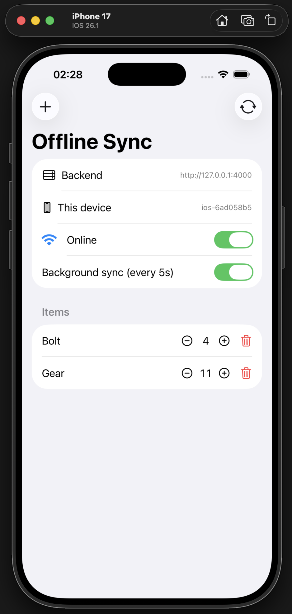

# rust-mobile-offline-sync

**Offline-first sync with a Rust core shared across iOS, Android, and the backend — via event sourcing.**

A small, honest demo of the architecture behind [TrainVision](https://trainvision.ai):
you capture data on a phone with no connection, and it reconciles cleanly with the
server (and other devices) once a connection returns. The domain model, the fold,
the ordering rules, and the sync engine are written **once in Rust**; the mobile
app gets them through UniFFI, the backend uses them directly.

> This is a stripped-down reference, not a library. The domain here is a boring
> inventory `Item`; the point is the *shape*, not the app.
>
> 📄 The write-up that explains the "why" is in [`POST.md`](./POST.md).

## The idea in one sentence

**Don't store the item — store the events that produced it.** Current state is a
fold over an append-only event log, which makes offline capture and multi-device
sync fall out naturally.

## Architecture

```
┌─────────────────────────────┐      ┌─────────────────────────────┐
│  iOS (SwiftUI)              │      │  Android (Kotlin)           │
│  thin UI, no logic          │      │  (same bindings)            │
└──────────────┬──────────────┘      └──────────────┬──────────────┘
               │ UniFFI (async)                      │
               ▼                                     ▼
┌───────────────────────────────────────────────────────────────────┐
│  client-sdk (Rust, compiled into the app)                         │
│   ffi.rs          ItemService + EventSourcedStores (uniffi)       │
│   item_service.rs local ops only — knows nothing about network    │
│   event_log.rs    DeviceEventLog: append_local / append /         │
│                   get_unsynced / mark_synced   (SQLite in reality)│
│   sync.rs         push unsynced → ack → pull after cursor         │
│   sync_runner.rs  background job (every N s) or sync_now,         │
│                   SyncListener callback → UI refresh              │
│   http.rs         HTTP client to the backend                      │
└──────────────────────────────┬────────────────────────────────────┘
              HTTP (JSON)      │ POST /events · GET /events?after=
                               ▼
┌───────────────────────────────────────────────────────────────────┐
│  backend (Rust, axum)                                             │
│   event_log.rs  ServerEventLog: assigns server_offset             │
│                 (Postgres/MySQL in reality)                       │
│   server.rs     POST /events · GET /events · GET /items           │
└──────────────────────────────┬────────────────────────────────────┘
                               │ both depend on
                               ▼
┌───────────────────────────────────────────────────────────────────┐
│  shared (Rust)                                                    │
│   core.rs         EventSourcedEntity, EventDescriptor, ordering   │
│   item.rs         the demo domain (Item + ItemEvent)              │
│   item_storage.rs projection storage: store → log + rebuild row;  │
│                   reads → projection table only                   │
│   event_log.rs    wire types + the EntityEventLog contract        │
└───────────────────────────────────────────────────────────────────┘
```

Each side has its **own event log implementation** (like the real app: SQLite on
device, Postgres on the backend); the projection storage and domain are shared
code. Everything here is in-memory so the demo runs with no database.

## How sync works

Every event carries provenance:

- `replica_id`, `replica_time_ms`, `replica_write_offset` — who authored it, when,
  with a per-replica tie-breaker (assigned by the local log on `append_local`).
- `server_offset: Option<...>` — position in the server's stream, assigned by the
  server when the event reaches it. **On a device, `None` means "not synced yet."**

A sync round is then:

1. **Push** — send local events where `server_offset IS NULL`; the server stores
   them (idempotently), assigns `server_offset`, and returns them; the device
   records the acknowledgement (`mark_synced`). No push cursor needed — the
   unsynced marker lives on the events themselves, and a retried push after a lost
   ack simply gets the same acknowledgement back.
2. **Pull** — ask for everything after the highest `server_offset` seen, append it
   to the local log (idempotent), rebuild the projections of touched entities.

Conflict resolution: every replica folds events in the same total order —
`replica_time → replica_write_offset → replica_event_id` — so all replicas
converge. **Deletion wins** over concurrent edits (a single `if deleted { return }`
in the fold).

The server folds pushed events into **its own projections** with the same shared
storage code — that's what `GET /items` serves.

## Run it

```sh
# The backend (in-memory storage; Postgres in reality):
cargo run -p backend --bin server
cargo test -p shared    # fold, two-replica convergence, deletion-wins
```

### Backend endpoints (poke at the demo)

| Endpoint | What you see |
|---|---|
| `GET /items` | Current items as the **server** sees them — projections folded server-side from the events the phones pushed |
| `GET /events/all` | The **full item event log** with all provenance (`replica_id`, `replica_time_ms`, `replica_write_offset`, `server_offset`, …) — the append-only source of truth |
| `GET /events?after=&limit=` | The sync **pull** stream: events after a `server_offset` cursor |
| `POST /events` | The sync **push**: append a batch; responds with the stored events incl. assigned `server_offset` (the device's ack) |
| `GET /health` | Liveness |

```sh
curl localhost:4000/items | jq            # what state does the server have?
curl localhost:4000/events/all | jq       # …and exactly which events produced it
```

## Build & run the iOS app

Requires Xcode, the Rust iOS targets (installed automatically by the pinned
toolchain), and [XcodeGen](https://github.com/yonatanp/XcodeGen)
(`brew install xcodegen`).

```sh
# 1. Compile the client-sdk for iOS → .xcframework + Swift bindings
./mobile/ios/build_rust.sh

# 2. Generate the Xcode project and open it
cd mobile/ios
xcodegen generate
open OfflineSyncDemo.xcodeproj

# 3. Have the backend running (the app syncs to http://127.0.0.1:4000)
cargo run -p backend --bin server
```

Run on an **Apple-Silicon simulator or a device** (the packaged `.xcframework`
ships arm64 device + arm64 simulator slices).

<p align="center">
  
</p>

The app is **one device** — a single `ItemService` + `SyncRunner`, with a replica
id generated on first launch. Two toggles drive the demo:

- **Online** — simulated connectivity, tracked by the Rust runner (a stand-in for
  a real reachability watcher). Flip it off, add and edit items — everything works
  and piles up locally with `server_offset = NULL`. Flip it back on and the runner
  **syncs immediately** (sync-on-reconnect); check `curl localhost:4000/items`.
- **Background sync (every 5s)** — the interval job, **on by default**. Ticks are
  skipped while offline.

### See sync in action: run two simulators

Each install gets its own replica id, so two simulators are two independent
devices converging through the real server:

```sh
cargo run -p backend --bin server        # keep the backend running
```

In Xcode, run the app on one simulator (e.g. iPhone 16), then change the run
destination to a **different** simulator model and run again — both stay open.
Place the two simulator windows side by side (background sync is already on), and:

1. Add items on device A → they appear on device B within ~5s.
2. Toggle device B **offline**, edit the same item on both devices, then bring B
   back online → both converge (later device clock wins).
3. Delete an item on A while B edits it offline → the deletion wins everywhere.

## What the demo intentionally leaves out

- **Persistence.** Everything is in-memory: the logs, the projection tables, the
  sync cursor. In the real app they're SQLite on the device and Postgres on the
  backend, behind the same contracts — swapping them in doesn't change the sync
  logic.
- **gRPC.** The demo syncs over plain HTTP/JSON; the real app uses gRPC. Same two
  calls (`push`, `pull`), different wire.
- **Connectivity detection.** The runner syncs on an interval or on demand; a real
  app also watches reachability and syncs when a connection returns.
- **Authorization.** The real event carries `space_id` / `owner_user_id` /
  `created_by`, and the server checks per event who may push/pull what. The demo
  omits those fields entirely.
- **Projection versioning.** The real storage guards concurrent projection
  rebuilds with optimistic versioning; unnecessary here.

## Layout

| Path | What |
|------|------|
| `shared/` | Domain + event-sourcing core, projection storage, wire types |
| `client-sdk/` | The mobile SDK: device log, sync engine + runner, HTTP client, UniFFI surface |
| `backend/` | axum server: server log, `POST/GET /events`, `GET /items` |
| `mobile/ios/` | SwiftUI app + `build_rust.sh` + XcodeGen spec |
| `POST.md` | The blog write-up |

## License

MIT
